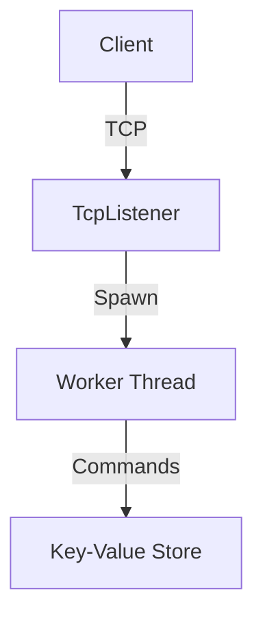

# Keystonelight
## A Concurrent Key-Value Store
### Smooth, Never Bitter


---

# Introduction

- **Goal**: Learn systems programming topics by building from scratch
- **Inspiration**: Redis-like server
- **Key Features**:
  - In-memory storage with disk persistence
  - Basic operations (GET, SET, DELETE)
  - TCP network interface
  - Concurrent client handling

---

# Data Persistence


- **Append-Only Log Design**
  - Inspired by Bitcask
  - Sequential writes for durability
  - Crash recovery through log replay
  - File locking considerations

---

# Compaction

- **Why?**
  - Reclaim disk space
  - Remove old/deleted entries
  - Prevent unbounded growth

- **How?**
  - Stop-the-world approach
  - Rewrite log with live data only
  - Safe file swapping
  - Coordinated with write operations

---

# Concurrency with RwLock

```rust
// Thread-safe storage
let store = Arc::new(RwLock::new(HashMap::new()));

// Reading (multiple threads)
let read_guard = store.read().unwrap();
let value = read_guard.get(&key);

// Writing (exclusive access)
let mut write_guard = store.write().unwrap();
write_guard.insert(key, value);
```

---

# Network Architecture



- Thread-per-connection model
- Simple text-based protocol
- Concurrent client handling
- Graceful connection management

---

# Process Management

- **PID File**
  - Process identification
  - Single instance enforcement
  - Clean shutdown handling

- **Signal Handling**
  - Safe signal processing
  - OS integration

---

# Technical Challenges

1. **Concurrency**
   - Thread safety
   - Lock management
   - Deadlock prevention

2. **Persistence**
   - File I/O
   - Crash recovery
   - Data consistency

3. **Networking**
   - Protocol design
   - Error handling
   - Connection management

---

# Lessons Learned

- Rust's safety guarantees shine in systems programming
- Test-driven development is helpful
- Concurrency requires careful coordination
- Maintenance tasks are crucial

---

# Keystone Light

- **Smooth**: No crashes, no data loss
- **Never Bitter**: No need to worry about data corruption